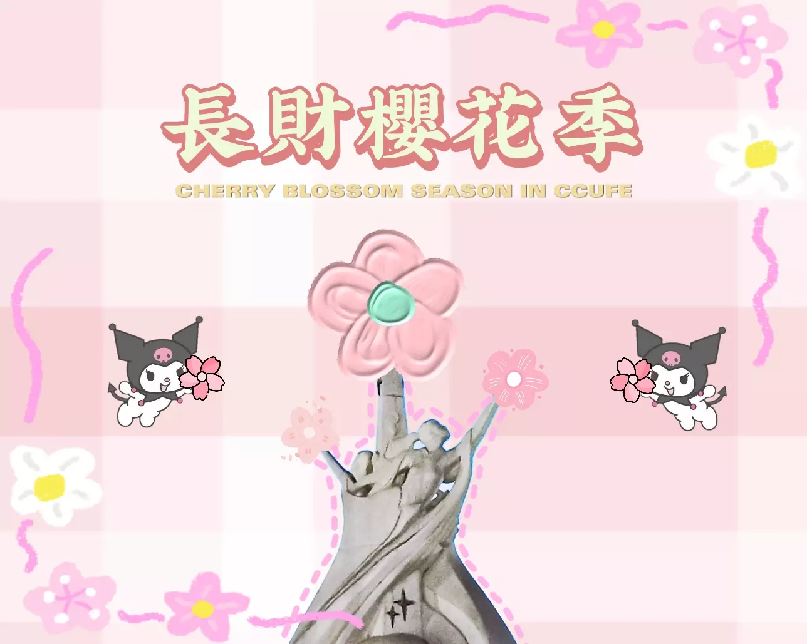

# sakura-ccufe

WeChat mini program. Open source at the request of the employer.

 

    
    <h3 align="center">sakura-ccufe</h3>
    

        A simple tool for image generation
         
        <a href="https://github.com/troyxun/sakura-ccufe/blob/master/README.md"><strong>Explore Document »</strong></a>
         
        <a href="https://github.com/troyxun/sakura-ccufe/blob/master/README.zh-cn.md"><strong>探索项目文档 »</strong></a>
         
         
        
         
        Scan code to view demo
         
        <a href="https://github.com/troyxun/sakura-ccufe/blob/master/images/demo.png">View Demo</a>
        ·
        <a href="https://github.com/troyxun/sakura-ccufe/issues">Report Bug</a>
        ·
        <a href="https://github.com/troyxun/sakura-ccufe/issues">Suggest Feature</a>
    

 
## Table of Contents

- [sakura-ccufe](#sakura-ccufe)
  - [Table of Contents](#table-of-contents)
  - [Maintainers](#maintainers)
  - [Contributing](#contributing)
    - [Contributors](#contributors)
  - [License](#license)

## Maintainers

- Designed by C h e n g
- Developed by [Troy](https://github.com/troyxun) with ♥

## Contributing

Feel free to dive in! [Open an issue](https://github.com/troyxun/sakura-ccufe/issues/new) or submit PRs.

This project follows the [Contributor Covenant Code of Conduct](https://www.contributor-covenant.org/version/2/1/code_of_conduct/).

### Contributors

*You can look up all the developers who have contributed to this project in [Contributors](https://github.com/troyxun/sakura-ccufe/graphs/contributors).*

## License

[MIT](https://github.com/troyxun/sakura-ccufe/blob/master/LICENSE) © Troy
