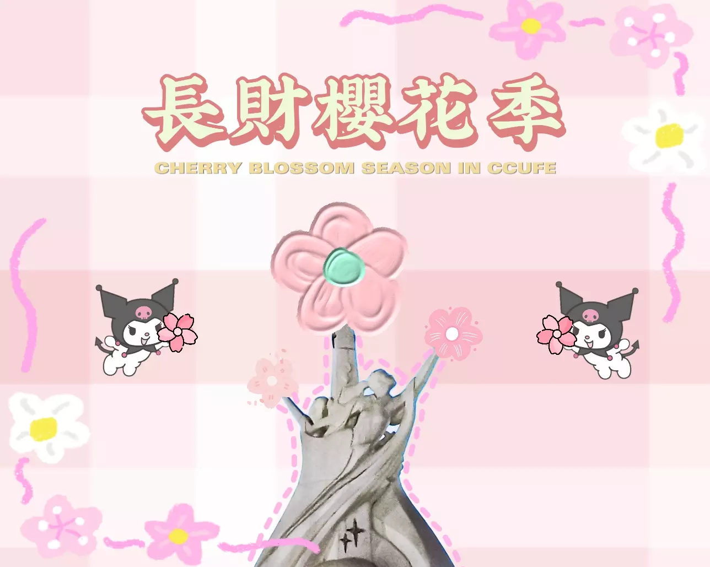

# 长财 2022 樱花透卡

微信小程序，应甲方要求开源。

 

    
    <h3 align="center">长财 2022 樱花透卡</h3>
    

        一个简易的图片生成工具，应甲方要求开源。
         
        <a href="https://github.com/troyxun/sakura-ccufe/blob/master/README.md"><strong>Explore Document »</strong></a>
         
        <a href="https://github.com/troyxun/sakura-ccufe/blob/master/README.zh-cn.md"><strong>探索项目文档 »</strong></a>
         
         
        
         
        扫码查看 Demo
         
        <a href="https://github.com/troyxun/sakura-ccufe/blob/master/images/demo.png">查看 Demo</a>
        ·
        <a href="https://github.com/troyxun/sakura-ccufe/issues">报告 Bug</a>
        ·
        <a href="https://github.com/troyxun/sakura-ccufe/issues">提出 Feature</a>
    

 
## 内容列表

- [长财 2022 樱花透卡](#长财-2022-樱花透卡)
  - [内容列表](#内容列表)
  - [维护者](#维护者)
  - [如何贡献](#如何贡献)
    - [贡献者](#贡献者)
  - [许可协议](#许可协议)

## 维护者

- Designed by C h e n g
- Developed by [Troy](https://github.com/troyxun) with ♥

## 如何贡献

非常欢迎你的加入！[提一个 Issue](https://github.com/troyxun/sakura-ccufe/issues/new) 或者提交一个 Pull Request。

本项目遵循 [贡献者契约行为准则](https://www.contributor-covenant.org/version/2/1/code_of_conduct/)。

### 贡献者

*您可以在 [Contributors](https://github.com/troyxun/sakura-ccufe/graphs/contributors) 中查阅所有为本项目做出贡献的开发者。*

## 许可协议

[MIT](https://github.com/troyxun/sakura-ccufe/blob/master/LICENSE) © Troy
